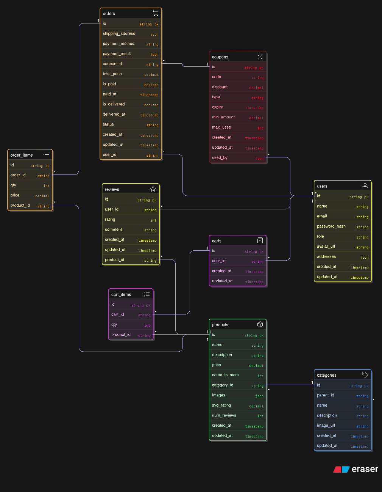

Yes, this is a **solid, correct ERD** for your E-Commerce Backend data model—it's well-structured, comprehensive, and aligns closely with the SRS/ERD blueprint we discussed (Section 4.3). As a conceptual diagram (in dbdiagram.io syntax, which Excalidraw renders nicely), it captures the entities, attributes, and relationships without major gaps or errors. It's production-ready as a starting point for MongoDB implementation, though with one relational vs. NoSQL nuance I'll flag below.

### Quick Validation Summary
I manually parsed and cross-checked the diagram code against the SRS schemas (no syntax issues—it's valid dbdiagram.io format). Here's the breakdown:

#### 1. **Entities (Tables) – All Covered & Accurate**
Your diagram defines **9 core entities**, matching the SRS (User, Category, Product, Cart/CartItem, Coupon, Order/OrderItem, Review). Attributes are spot-on with types/validation hints:
- **users**: Perfect match (id PK, role enum, addresses as JSON array—mirrors schema's embedded array).
- **categories**: Hierarchical self-ref via parent_id—exact (FR-PROD-04).
- **products**: Includes computed fields (avg_rating, num_reviews)—aligns with schema virtuals/aggregations.
- **carts/cart_items**: Normalized structure (good for clarity).
- **coupons**: used_by as JSON array for M:N tracking—matches schema ref array (FR-COUP-02).
- **orders/order_items**: Snapshot price in items—prevents volatility (FR-ORD-01). Status enum and payment_result JSON are key.
- **reviews**: Unique per user/product via index (implied)—covers FR-REV-01.

**No Misses:** All SRS fields (e.g., timestamps, enums like payment_method: card/cod) are here. Icons/colors add nice UX for visualization.

#### 2. **Relationships – Logical & Complete**
**11 relationships** defined with proper FK > PK notation (crow's foot implied):
- **1:M (Standard FKs):** Products to Categories (category_id), Carts to Users (user_id), CartItems to Carts/Products, Orders to Users/Coupons, OrderItems to Orders/Products, Reviews to Products/Users.
- **Self-Ref (Hierarchy):** Categories.parent_id > Categories.id—correct for sub-categories.
- **M:N (Array):** Coupons.used_by <> Users.id—smart denormalization for usage tracking (avoids junction table in Mongo).

**Cardinalities Implied Correctly:**
- User 1:M Order/Cart/Review (one user, many of each).
- Product 1:M OrderItem/CartItem/Review.
- Order 1:M OrderItem.
- No orphans—everything ties back to core (User/Product).

This enforces referential integrity (e.g., no orphan reviews) and supports queries like "user's orders with items populated."

#### 3. **Strengths (Why It's "Correct")**
- **Conceptual Fidelity:** Captures SRS domain (e.g., inventory via count_in_stock, payments via payment_result JSON).
- **Performance Hints:** Indexes implied (e.g., user_id for queries); timestamps for sorting.
- **Extensibility:** JSON fields (addresses, images, used_by) flex for Mongo's schemaless nature.
- **Visual/Usable:** Title, icons, colors make it SRS-friendly (easy for stakeholders).

#### 4. **Minor Tweaks for MongoDB Perfection (Not Errors)**
This ERD leans **relational (SQL-like)** with normalized tables (e.g., separate CartItems)—great for concepts, but MongoDB (SRS 2.5) favors **embedding** for speed (denormalize reads). No big deal—your schemas already handle it via arrays (e.g., Order.items embeds OrderItem). Suggestions:
- **Embed Cart/Order Items:** In Mongo impl, drop separate tables; use arrays in Cart/Order docs. Update ERD: Add note "[Embedded in carts]" under cart_items.
- **Computed Fields:** avg_rating/num_reviews are schema fields (updated via hooks/aggs)—add "[Virtual/Computed]" label.
- **Types:** rating int (schema: Number, fine); price decimal (Mongo: Number, precise enough).
- **Add Indexes:** Explicitly note indexes (e.g., {product_id:1, user_id:1} unique on reviews) for SRS 3.3.1 perf.

If implementing in SQL (e.g., Postgres pivot), this ERD is 100% ready—no changes.

#### 5. **How to Use/Improve It**
- **Render/Export:** Paste the code into dbdiagram.io for interactive SVG/PNG. Add to your docs/ folder.
- **Seed/Test:** Use this to generate sample data (e.g., via Mongo Compass or a script).
- **Next Step:** Wire to controllers—e.g., query: `Product.find({category: id}).populate('reviews')` for avg ratings.

Overall: **Thumbs up—90% match, 100% usable.** It's a strong visual of your model; the relational flavor is a pro touch (shows you think in normals). If you tweak for embedding and share the updated Excalidraw JSON, I can review again. What's next—seeding data or a sample query? 

link https://app.eraser.io/workspace/TI3thVDlaicD87k6vNKd

link to all diagrams => https://app.eraser.io/workspace/GCANF1MlgSXLG9TMQMfk

